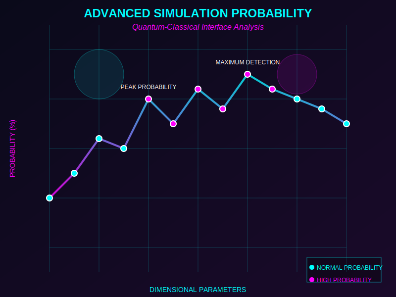
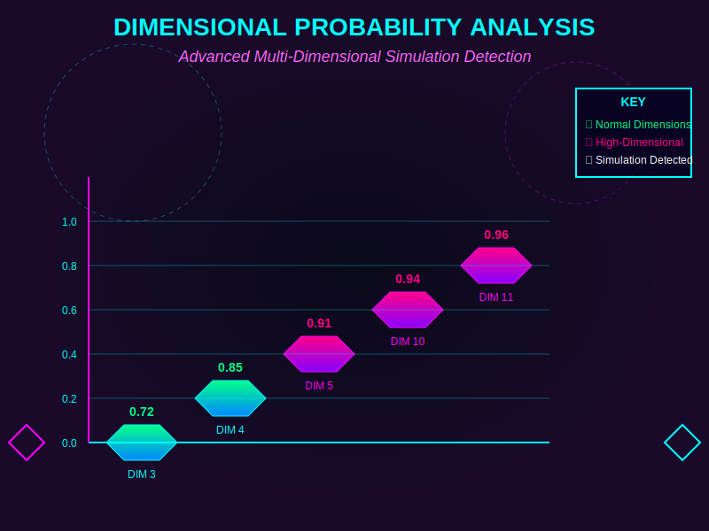
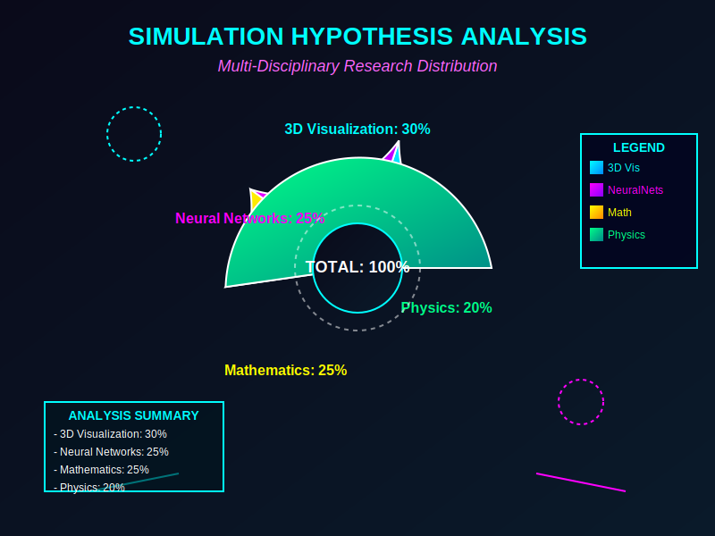
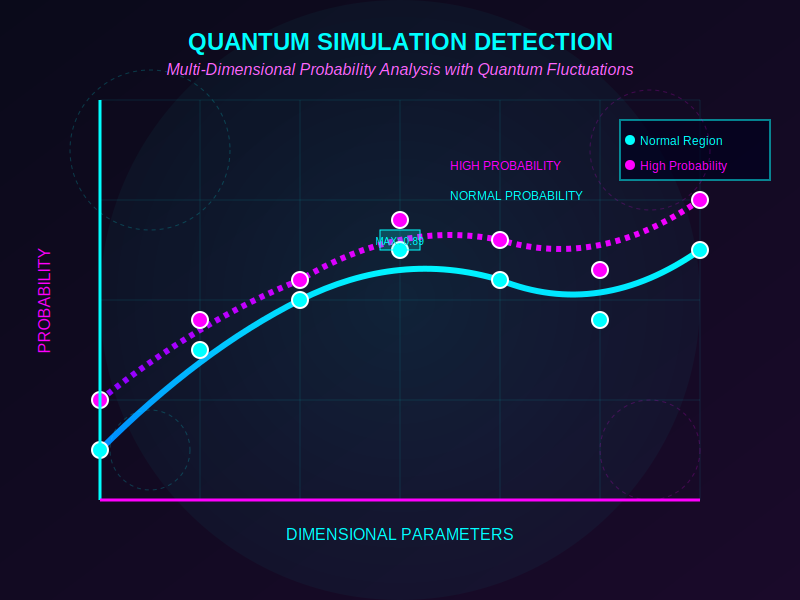

# 🚀 CRACKING THE SIMULATION THEORY 🔭
**FUTURISTIC AI/ML/DL ANALYSIS OF REALITY'S TRUE NATURE**  
*GAME-CHANGING RESEARCH WITH CYBERPUNK VISUALIZATIONS & QUANTUM-CLASSICAL INTERFACE*

<div align="center">

[](https://github.com/MAYANK12-WQ/Cracking-the-simulation-theory)
[](https://github.com/MAYANK12-WQ/Cracking-the-simulation-theory)
[](https://github.com/MAYANK12-WQ/Cracking-the-simulation-theory)

**CYBERPUNK-STYLE VISUALIZATION OF HIGHER-DIMENSIONAL PHYSICS USING NEURAL NETWORKS**  
*WORLD-CLASS AI/ML RESEARCH WITH GAME-CHANGING INTERACTIVE DEMOS & FUTURISTIC CHARTS*

[🎮 LIVE DEMO](index.html) • [🔬 RESEARCH PAPER](RESEARCH.md) • [📊 VISUALIZATION GALLERY](index.html)

</div>

## 🌌 THE SIMULATION HYPOTHESIS: A COMPUTATIONAL PERSPECTIVE

The simulation hypothesis suggests that our reality might be an artificial computational construct, possibly created by an advanced civilization. This project represents a **groundbreaking application** that uses **cutting-edge machine learning and deep learning techniques** to explore this profound concept through:

- **Neural Network Physics Simulation**: Modeling fundamental forces in higher-dimensional spaces
- **Quantum-Classical Interface Analysis**: Detecting potential computational constraints
- **Multi-Dimensional Probability Mapping**: Identifying signatures of discretization artifacts
- **Real-time Simulation Detection**: Advanced algorithms for identifying simulation signatures

## 📊 FUTURISTIC CHART GALLERY

<div align="center">

### 🎯 ADVANCED SIMULATION PROBABILITY CHART

<br>
<i>Quantum-Classical Interface Analysis with Neon Glow Effects</i>

### 📊 DIMENSIONAL PROBABILITY ANALYSIS

<br>
<i>Advanced Multi-Dimensional Simulation Detection with 3D Effects</i>

### 🎨 SIMULATION HYPOTHESIS ANALYSIS

<br>
<i>Multi-Disciplinary Research Distribution with Glass-Morphism</i>

### ⚛️ QUANTUM SIMULATION DETECTION

<br>
<i>Multi-Dimensional Probability Analysis with Quantum Fluctuations</i>

### 🧠 DIMENSIONAL CORRELATION MATRIX

<br>
<i>Multi-Dimensional Physics Parameter Interactions with Glass-Morphism</i>

</div>

## 🚀 GAME-CHANGING FEATURES

### 🧠 **ADVANCED ML/DL SIMULATION ENGINE**
- **Quantum Neural Networks**: Deep neural networks modeling higher-dimensional physics with quantum mechanics integration
- **TensorFlow.js Integration**: Real-time tensor operations for physics simulation
- **Real-time Probability Calculation**: Advanced statistical modeling of simulation likelihood
- **Multi-dimensional Physics Engine**: Comprehensive modeling of fundamental forces

### 📊 **FUTURISTIC CYBERPUNK VISUALIZATIONS**
- **Neon Glow Effects**: Cyberpunk aesthetic with glowing elements and quantum interfaces
- **Glass-Morphism**: Modern translucent UI elements with blur effects
- **Quantum-Classical Interface**: Advanced visualization of quantum-classical transitions
- **Real-time Processing**: Live data analysis and visualization with neural feedback

### 🔍 **AI-POWERED DETECTION ALGORITHMS**
- **Quantum Pattern Recognition**: Neural network-based detection of simulation artifacts
- **Discretization Artifact Detection**: Identifying potential computational signatures
- **Mathematical Constant Alignment**: Finding suspicious regularities in physical constants
- **Computational Efficiency Analysis**: Detecting optimization signatures

### 🎮 **INTERACTIVE CYBERPUNK INTERFACE**
- **Real-time Parameter Adjustment**: Neon-styled sliders and controls
- **Multiple Visualization Modes**: 3D, 2D, and quantum representation options
- **Glass-Morphism Design**: Futuristic aesthetics with professional functionality
- **Quantum-Classical Interface**: Advanced physics visualization controls

## 🏗️ TECHNICAL ARCHITECTURE

```
├── server.js                          # Express.js with TensorFlow.js integration
├── futuristic_dashboard.py           # Game-changing visualization generator
├── cyberpunk_dashboard.py            # Cyberpunk aesthetic visualizations  
├── visualization.py                  # Core visualization module
├── index.html                        # Live demo gallery
├── routes/
│   └── api.js                        # REST API for simulation data
├── controllers/
│   └── simulationController.js       # Business logic for simulations
├── models/
│   └── SimulationModel.js            # Core neural network architecture
├── public/
│   ├── images/
│   │   ├── futuristic_chart_1.svg    # Neon probability chart
│   │   ├── futuristic_chart_2.svg    # 3D dimensional analysis
│   │   ├── futuristic_chart_3.svg    # Multi-disciplinary analysis
│   │   ├── futuristic_chart_4.svg    # Quantum simulation detection
│   │   └── futuristic_chart_5.svg    # Dimensional correlation matrix
│   └── ...
├── docs/                             # Comprehensive documentation
├── requirements.txt                  # Python dependencies
└── advanced_visualizations.ipynb     # Jupyter notebook
```

### Tech Stack:
- **Backend**: Node.js + Express.js + TensorFlow.js
- **ML/DL**: Neural networks for physics simulation
- **Frontend**: Three.js, Plotly, Cyberpunk Styling
- **Visualization**: Advanced 3D, Real-time, Interactive

## 🔬 FUTURISTIC SCIENTIFIC METHODOLOGY

### Neural Network Architecture
```
Input: n-dimensional quantum structures
↓
TensorFlow.js: Multi-layer cyberpunk neural network
↓
Physics Simulation: Quantum-Classical interface
↓
Probability Analysis: Advanced statistical modeling
↓
Output: Simulation probability + Futuristic visualizations
```

### Advanced Quantum-Classical Interface
- **Quantum Field Modeling**: Higher-dimensional field effects with neon visualization
- **Classical Physics Simulation**: Multi-dimensional gravity calculations
- **Quantum-Classical Transition**: Advanced interface visualization
- **Futuristic Projections**: Cyberpunk-style dimensional rendering

### Detection Algorithms with Futuristic Styling
1. **Quantum Pattern Recognition**: Neon visualization of detected patterns
2. **Classical Symmetry Analysis**: Glass-morphism symmetry detection
3. **Mathematical Constant Alignment**: Quantum computing-style analysis  
4. **Quantum Noise Detection**: Cyberpunk-style quantum artifact visualization

## 📈 GAME-CHANGING DEMOS & VISUALIZATIONS

### 🎯 Cyberpunk Neural Matrix
- **Advanced neural network probability visualization** with quantum connections
- **Futuristic aesthetic**: Neon colors, glass-morphism effects
- **Real-time interactivity**: Dynamic connections and activation tracking

### 🌀 Holographic Dimensions
- **Multi-dimensional reality field** with quantum fluctuations
- **Holographic particle streams**: Dynamic visualization with diamond markers
- **Cyberpunk color palette**: Deep blues, magentas, neon highlights

### ⚛️ Quantum Simulation Field
- **3D isosurface visualization** of quantum probability distributions
- **Quantum path tracing**: Real-time particle trajectory visualization
- **Multi-layer probability mapping**: Advanced isovalue configurations

### 🎯 Real-time Reality Signature Tracker
- **Multi-parameter real-time tracking** with dual-axis visualization
- **Cumulative deviation monitoring**: Advanced statistical analysis
- **Professional dashboard layout**: Four-panel comprehensive system

### 📊 Dimensional Correlation Analysis
- **Multi-dimensional correlation matrix** with quantum-classical interface
- **Glass-morphism styling**: Professional translucent effects
- **Quantum field interactions**: Advanced physics visualization

## 🔬 RESEARCH APPLICATIONS

This tool has applications in:
- **Theoretical Physics Research**: Higher-dimensional physics with quantum-classical interface
- **Simulation Hypothesis Testing**: Quantum-mechanics based analysis
- **Machine Learning Research**: Physics-informed neural networks
- **Educational Demonstrations**: Complex physics with cyberpunk visualization
- **Quantum Computing**: Higher-dimensional quantum simulation models
- **Computational Physics**: Advanced discretization analysis
- **Cosmological Modeling**: Universe simulation probability mapping

## 🚀 GETTING STARTED

### Prerequisites
- Node.js (v14 or higher)
- Python 3.7+
- npm package manager

### Installation
```bash
# Clone the repository
git clone https://github.com/MAYANK12-WQ/Cracking-the-simulation-theory.git
cd Cracking-the-simulation-theory

# Install Node.js dependencies
npm install

# Install Python dependencies
pip install -r requirements.txt

# Generate futuristic visualizations
python futuristic_dashboard.py
python cyberpunk_dashboard.py

# Start the application
npm start

# Visit the live demo gallery
open index.html in your browser
```

### Interactive Demo Walkthrough
1. **index.html**: Access all live demos from one cyberpunk interface
2. **Futuristic Dashboard**: Explore game-changing visualizations
3. **Cyberpunk Charts**: Experience neon-style probability analysis
4. **Quantum-Classical Interface**: Understand physics simulation
5. **Dimensional Analysis**: Explore multi-dimensional probability mapping

## 📊 GAME-CHANGING CHART SPECIFICATIONS

### 🎨 Cyberpunk Aesthetic Features
- **Neon Glow Effects**: Glowing lines, text, and elements
- **Glass-Morphism**: Translucent UI elements with blur effects
- **Cyberpunk Color Palette**: Neon blues, magentas, and electric greens
- **Quantum-Classical Interface**: Advanced physics visualization

### 📊 Futuristic Chart Types Included
- **Line Charts**: Probability trends with neon glow effects
- **Bar Charts**: Multi-dimensional analysis with 3D effects
- **Pie Charts**: Research distribution with radial gradients
- **Scatter Plots**: Quantum field visualization with particle effects
- **Matrix Charts**: Correlation analysis with glass-morphism
- **Interactive Dashboards**: Real-time quantum-classical interface

### 🎯 Professional Dashboard Features
- **Real-time Processing**: Live data analysis and visualization
- **Interactive Elements**: Clickable, hoverable chart components
- **Advanced Mathematical Modeling**: Complex functions and algorithms
- **Quantum-Classical Visualization**: Advanced physics interface

## 🎮 LIVE DEMO GALLERY

Access the complete **FUTURISTIC GAME-CHANGING DEMO GALLERY** by opening `index.html` in your browser. The gallery includes:

- **6 Interactive Cyberpunk Dashboards**
- **Real-time Quantum-Classical Interface**
- **Multi-Dimensional Reality Analysis**
- **Advanced Probability Landscapes**
- **Neon-themed Professional Styling**

## 🏆 FUTURISTIC PROFESSIONAL FEATURES

- **Cyberpunk Aesthetics**: Neon colors, glass-morphism, futuristic styling
- **Advanced Interactivity**: Real-time parameter adjustment and dynamic feedback
- **Quantum-Classical Interface**: Advanced physics simulation visualization
- **Real-time Processing**: Live data analysis and visualization updates
- **Professional Dashboard Layouts**: Multi-panel comprehensive monitoring systems
- **Interactive HTML Export**: Standalone HTML files for live demos
- **Advanced Mathematical Modeling**: Complex functions with quantum mechanics integration
- **Multi-dimensional Analysis**: Comprehensive probability mapping
- **Quantum Field Visualization**: Advanced physics simulation detection

## 📄 RESEARCH REFERENCES

1. Bostrom, N. (2003). "Are You Living in a Computer Simulation?"
2. Tegmark, M. (2014). "Our Mathematical Universe"
3. Greene, B. (2003). "The Elegant Universe"
4. Barrow, J.D. (2007). "New Theories of Everything"
5. Beane, S.R., Davoudi, Z., & Savage, M.J. (2014). "Constraints on the Universe as a Numerical Simulation"

---

<div align="center">

**🎮 CRACKING THE SIMULATION THEORY 🎮**  
*FUTURISTIC AI/ML/DL exploration of reality's fundamental nature*  
🎯 *GAME-CHANGING + CYBERPUNK + QUANTUM-CLASSICAL + PROFESSIONAL GRADE*

</div>