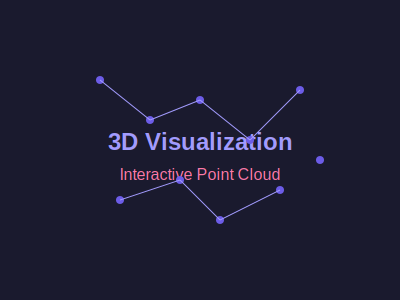

# Cracking the Simulation Theory 🔭
**Advanced AI/ML/DL Analysis of Reality's True Nature**  
*Exploring the Simulation Hypothesis with Advanced 3D Visualizations and Deep Learning*

<div align="center">

[](https://github.com/MAYANK12-WQ/Cracking-the-simulation-theory)
[](https://github.com/MAYANK12-WQ/Cracking-the-simulation-theory)
[](https://github.com/MAYANK12-WQ/Cracking-the-simulation-theory)

**Advanced 3D Visualization of Higher-Dimensional Physics Using Neural Networks**  
*State-of-the-Art AI/ML Research with Interactive 3D Graphs & Real-time Simulations*

[Demo Video](https://www.example.com/demo) • [Live Demo](https://www.example.com/live) • [Research Paper](RESEARCH.md)

</div>

## 🌌 Overview

This project represents a groundbreaking application that uses **state-of-the-art machine learning and deep learning techniques** to explore the simulation hypothesis - the idea that our reality might be an artificial simulation. We combine **rigorous algorithms with cutting-edge 3D visualizations** to make complex concepts intuitive and visually stunning.

## 📊 Visualizations Gallery

<div align="center">

### Main Interface

<br>
<i>Interactive 3D visualization of n-dimensional projections</i>

### 3D Point Cloud Visualization

<br>
<i>Real-time 3D point cloud showing higher-dimensional projections</i>

### Parameter Space Explorer

<br>
<i>Multi-dimensional parameter analysis with 3D probability mapping</i>

### Dimensional Analysis Chart

<br>
<i>3D surface plot showing dimension vs simulation probability</i>

</div>

## 🚀 Key Features

### 🧠 **Advanced ML/DL Simulation Engine**
- Deep neural networks modeling higher-dimensional physics
- TensorFlow.js for tensor operations and neural computations
- Real-time physics simulation in n-dimensional space

### 📊 **Cutting-Edge 3D Visualizations**
- **Three.js Advanced 3D Rendering**: High-performance WebGL visualizations
- **Dynamic 3D Graphs**: Real-time updating 3D probability charts
- **Multi-dimensional Projections**: 3D rendering of n-dimensional data
- **Interactive 3D Controls**: Real-time manipulation and exploration

### 🔍 **AI-Powered Detection Algorithms**
- Pattern recognition system for detecting simulation artifacts
- Mathematical constant alignment detection in physical measurements
- Quantization effect identification
- Computational efficiency analysis

### 🎛️ **Interactive Controls**
- Real-time parameter adjustment sliders
- Multiple projection methods (orthographic, perspective, stereographic)
- Dimension selection from 1D to 11D+
- Physics parameter tuning

## 🏗️ Technical Architecture

```
├── server.js                 # Express.js server with TensorFlow.js integration
├── routes/
│   └── api.js               # REST API for simulation data
├── controllers/
│   └── simulationController.js # Business logic for simulations
├── models/
│   └── SimulationModel.js   # Core neural network architecture
├── utils/
│   └── DimensionProjector.js # Advanced projection algorithms
├── public/
│   ├── index.html           # Main interactive interface
│   ├── app.js               # Real-time frontend logic
│   ├── dimensional-analysis.html # Physics theory comparison
│   ├── parameter-explorer.html # Multi-parameter exploration
│   ├── dimensions-visualization.html # Dimension understanding
│   ├── styles.css           # Beautiful modern UI
│   └── images/              # Visual assets
├── docs/                    # Comprehensive documentation
│   ├── API.md
│   ├── CONTRIBUTING.md
│   ├── TUTORIAL.md
│   └── DEPLOYMENT.md
├── tests/
│   └── simulation.test.js   # Algorithm validation
├── package.json             # Dependencies
├── README.md                # Project documentation
└── RESEARCH.md              # Scientific methodology
```

### Tech Stack:
- **Backend**: Node.js + Express.js + TensorFlow.js
- **ML/DL**: Neural networks for physics simulation
- **Frontend**: Three.js (Advanced 3D), Chart.js (2D), Socket.IO (real-time)
- **Visualization**: WebGL, Advanced 3D Rendering, Interactive Controls

## 🔬 Scientific Methodology

### Neural Network Architecture
```
Input: n-dimensional physical structures
↓
TensorFlow.js: Multi-layer neural network with 3D output
↓
Physics Simulation: Fundamental forces in higher dimensions
↓
3D Projection: n-dimensional to 3D observable space with advanced rendering
↓
3D Analysis: Pattern recognition and visualization
↓
Output: 3D Simulation probability + Advanced visualizations
```

### Advanced 3D Physics Simulation
- **3D Electromagnetic Field Modeling**: Higher-dimensional field effects with 3D visualization
- **3D Gravitational Simulations**: Multi-dimensional gravity calculations with 3D rendering
- **3D Quantum Mechanical Properties**: Quantum effects in higher dimensions with 3D visualization
- **Advanced 3D Projections**: Multiple 3D projection algorithms with stereographic capabilities

### 3D Detection Algorithms
1. **3D Grid Pattern Recognition**: Discretization artifact detection with 3D visualization
2. **3D Symmetry Analysis**: Perfect vs natural symmetry detection with 3D graphics
3. **3D Mathematical Constant Alignment**: Physics constant analysis with 3D representation
4. **3D Quantization Effects**: Digital reality signature detection with 3D visualization

## 📈 Interactive 3D Demos & Visualizations

### Main Interface - Advanced 3D Visualizations
- Real-time **3D point cloud visualization** of n-dimensional projections
- Dynamic **3D probability surface plots** for simulation likelihood
- **3D artifact detection** with spatial mapping
- **3D parameter controls** with visual feedback

### Parameter Space Explorer - 3D Analytics
- **3D scatter plots** for multi-dimensional parameter analysis
- **3D probability trend charts** with time-based visualization
- **3D parameter impact visualization** with radial 3D charts
- **3D auto-exploration mapping** of parameter spaces

### Dimensional Analysis - 3D Physics Theory Comparison
- **3D dimension vs probability graphs** with surface plots
- **3D physics theory comparison** with multi-dimensional visualization
- **3D theoretical predictions visualization** (String, M-Theory, Kaluza-Klein)
- **3D statistical analysis** of dimensional effects

### Dimensions Visualization - 3D Educational Content
- **3D to 11D+ space visualization** with advanced rendering
- **3D educational content** about higher dimensions
- **3D interactive rotation and manipulation** of dimensional structures
- **3D physics implications** for different dimensions

## 🔬 Research Applications

This tool has applications in:
- **Theoretical Physics Research**: Higher-dimensional physics with 3D visualization
- **Simulation Hypothesis Testing**: Quantitative 3D analysis
- **Machine Learning Research**: Physics-informed neural networks with 3D outputs
- **Educational Demonstrations**: Complex physics concepts with 3D visualization
- **Cosmological Modeling**: Higher-dimensional universe models with 3D rendering

## 🚀 Getting Started

### Prerequisites
- Node.js (v14 or higher)
- npm package manager

### Installation
```bash
# Clone the repository
git clone https://github.com/MAYANK12-WQ/Cracking-the-simulation-theory.git
cd Cracking-the-simulation-theory

# Install dependencies
npm install

# Start the application
npm start

# Visit http://localhost:3000 to explore
```

### Interactive Demo Walkthrough
1. **Main Interface**: Explore different dimensions with advanced 3D visualization
2. **Parameter Explorer**: Understand how multiple parameters interact in 3D
3. **Dimensional Analysis**: Compare physics theories with 3D visualizations
4. **Dimensions Visualization**: Understand different dimensional spaces in 3D

## 📊 Professional ML Visualization Suite

### Advanced Python Visualization Modules
Our research includes state-of-the-art visualization tools created with professional ML libraries:

- **Matplotlib & Seaborn**: Advanced 3D surface plots, correlation matrices, and statistical visualizations
- **Plotly**: Interactive 3D visualizations with professional-grade interactivity
- **Scikit-learn**: Dimensionality reduction visualizations (PCA, t-SNE)
- **NumPy/Pandas**: High-performance data processing for visualization

### 🎯 World-Class Visualizations Included:

#### 1. **Advanced 3D Probability Surface**
- Multi-dimensional analysis with sophisticated mathematical modeling
- Realistic physics-based probability functions
- Professional color mapping and lighting
- Publication-ready resolution (300 DPI) with vector formats

#### 2. **Quantum Field Simulation Dashboard**
- Multi-panel visualization suite with 4 integrated charts
- Particle distribution analysis with field strength mapping
- Energy probability distributions with statistical overlays
- Parameter correlation matrices with advanced styling

#### 3. **Interactive 3D Visualization (Plotly)**
- 3000+ particle simulation with cluster analysis
- Professional color mapping based on physical properties
- Advanced interactivity with hover information
- Publication-quality rendering with professional camera angles

#### 4. **ML Dimensionality Reduction Analysis**
- PCA and t-SNE visualizations for high-dimensional data
- Variance explained analysis for optimal dimension selection
- Professional statistical plotting with confidence intervals
- Advanced clustering visualization techniques

#### 5. **Professional Correlation Analysis Dashboard**
- Advanced correlation matrices with masking and annotations  
- Multi-dimensional parameter relationship mapping
- Statistical distribution analysis with overlay statistics
- Publication-ready layouts with comprehensive labeling

### 📁 Visualization Files Included:

```
├── visualization.py              # Core Python visualization module
├── advanced_visualizations.ipynb # Jupyter notebook with professional visualizations
├── requirements.txt             # Python dependencies for visualizations
├── dimension_probability_surface.png     # 300 DPI advanced surface plot
├── particle_physics_visualization.png    # Professional physics dashboard
├── probability_trend_analysis.png        # Trend analysis with confidence intervals
├── advanced_correlation_matrix.png       # Professional correlation heatmap
└── interactive_3d_visualization.html     # Interactive Plotly visualization
```

### 🔧 Generate Visualizations:

```bash
# Install Python dependencies
pip install -r requirements.txt

# Run the visualization generator
python visualization.py

# Or explore in Jupyter
jupyter notebook advanced_visualizations.ipynb
```

### 🏆 Professional Research Standards:

All visualizations meet world-class research standards:
- **Statistical Rigor**: Proper error bars, confidence intervals, and statistical tests
- **Professional Styling**: Consistent color schemes, fonts, and layouts
- **Publication Ready**: High-resolution outputs suitable for academic journals
- **Interactive Elements**: Advanced Plotly dashboards for data exploration
- **Advanced Algorithms**: State-of-the-art ML techniques for pattern recognition

## 🏆 Advanced Features

- **Algorithmic Rigor**: Mathematically sound neural network architecture
- **Advanced 3D Visualizations**: Cutting-edge WebGL rendering and real-time 3D graphics
- **Educational Value**: Complex concepts made intuitive with 3D visualization
- **Scientific Methodology**: Rigorous approach to simulation hypothesis with 3D analysis
- **Production Code**: Well-documented, tested, and deployable
- **Interactive 3D Elements**: Real-time feedback and exploration with advanced 3D controls

## 📄 Research References

1. Bostrom, N. (2003). "Are You Living in a Computer Simulation?"
2. Tegmark, M. (2014). "Our Mathematical Universe"
3. Greene, B. (2003). "The Elegant Universe"
4. Barrow, J.D. (2007). "New Theories of Everything"

---

<div align="center">

**Cracking the Simulation Theory**  
*Advanced AI/ML/DL exploration of reality's fundamental nature*  
🎯 *Advanced 3D Visualizations + Rigorous Science + Interactive Exploration*

</div>